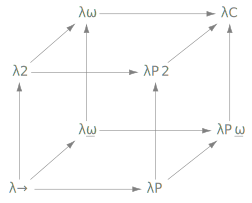

# λ-Cube (L3)

[](https://github.com/AdamLassiter/lambda-cube/actions/workflows/haskell.yml)
[](https://adamlassiter.github.io/lambda-cube/)
[](https://codecov.io/gh/AdamLassiter/lambda-cube)
[](/LICENSE)

Some thoughts on Calculus of Constructions...



```
λ>> (λ [x : Bool] -> not x) Bool@True
π [Bool : *] -> π [True : Bool] -> π [False : Bool] -> Bool
λ [Bool : *] -> λ [True : Bool] -> λ [False : Bool] -> False
```


## Compile, Test and Install
```
>> stack build
>> stack test
>> stack run

λ>> ...
```


## Syntax

### Calculus of Constructions
The core syntax is constructed from any of these expressions:

| Name        | Value         | Type      |
|-------------|---------------|-----------|
| Large Type  | *             | #         |
| Small Type  | T             | *         |
| Variable    | x             | X         |
| Expression  | e             | E         |
| Lambda      | λ(x:X).e      | π(x:X).E  |
| Pi          | π(x:X).T      | *         |
| Application | (λ(x:X).e) x  | E         |

### L3
A number of _required_ syntactic extensions are included to enable a self-hosted stdlib:

| Name                | Value  | Example            |
|---------------------|--------|--------------------|
| Comment             | --     | -- This is ignored |
| Namespace-Separator | @      | Nat@plus           |
<!--
| Feature-Flag *      | {...}  | { ANONYMOUSPI }    |

_* Must appear at Ln 0 Col 0 in the file, before all other content_
-->


## Feature Flags
In aid of usability, the core concept of L3 is enriched with these _optional_ extensions:

### Syntax Flags
The following flags can be used to configure certain Lexer-level syntactic sugars:

| Flag           | Description                                    | Example              |
|----------------|------------------------------------------------|----------------------|
| ANONYMOUSPI    | Require explicit binds for Pi expressions      | `O.τ.I`              |
| STRICTPARENS   | Enforce brackets/braces for types/expressions  | `(λ[x:*].x) (a)`     |
| SETSYNTAX      | Enable set-theory notation                     | `∀(τ∈⊥)->∃(x∈T)->x`  |
<!--
| DEBRUIJNENCODE | Enable implicit Nat-to-deBruijn encoding       | `Nat@plus 1 0`       |
-->


### Semantics Flags
The following flags can be used to configure certain core language behaviours:

| Flag          | Description                                    | Example              |
|---------------|------------------------------------------------|----------------------|
| TAUSUBSTITUTE | Disable stdlib types Tau type substitution     | `λ(x:Null).isNull x` |
<!--
| AUTOINFER     | Allow automatic inference of types `?`         | `(λ(x:?).E x) a`     |
-->

_It is left as an exercise to prove these semantic extensions are safe and well-founded._


### Logging Flags
The following `cpp-options` flags can be used to enable/disable logging calls at compile-time:

| Flag     | Description                                     |
|----------|-------------------------------------------------|
| LOGTRACE | Enable logging at TRACE level, implies LOGDEBUG |
| LOGDEBUG | Enable logging at DEBUG level, implies LOGINFO  |
| LOGINFO  | Enable logging at INFO level, implies LOGWARN   |
| LOGWARN  | Enable logging at WARN level                    |

In general, it is preferred to use `setLogLevel` or `set[Trace|Debug|Info|Warn|Error]SourceRegex`.
Nevertheless, there may be certain scenarios where either logs will never be desired, or there is some performance impact from stringification.


## Performance

### Benchmarking Ballpark
#### Intel i7-4770k
``` 
>> stack bench

benchmarking λ(T:*) . λ(x:T) . x
time                 859.1 μs   (853.5 μs .. 864.6 μs)
                     0.999 R²   (0.998 R² .. 1.000 R²)
mean                 874.8 μs   (865.7 μs .. 906.9 μs)
std dev              52.61 μs   (11.42 μs .. 109.3 μs)
variance introduced by outliers: 49% (moderately inflated)
                         
benchmarking λ(x:Nat) . Bool@eq (even x) (odd (Nat@Succ x))
time                 1.008 ms   (1.002 ms .. 1.013 ms)
                     0.999 R²   (0.999 R² .. 1.000 R²)
mean                 1.023 ms   (1.013 ms .. 1.069 ms)
std dev              60.27 μs   (12.37 μs .. 136.0 μs)
variance introduced by outliers: 47% (moderately inflated)
```


### Notes
* L3 _should_ be totally-normalising, but this may not currently be the case
  * `λ(x:Nat) . Bool@eq (even x) (odd (Nat@Succ x))` intuitionistically _could_ evaluate to `λ(x: Nat) . Bool@True`, but in actuality *does not*


## References
* [ChristopherKing42/CalculusOfConstructions.hs](https://gist.github.com/ChristopherKing42/d8c9fde0869ec5c8feae71714e069214)
* [Gabriel439/Haskell-Morte-Library](https://github.com/Gabriel439/Haskell-Morte-Library)
  * [Prelude](https://github.com/Gabriel439/Haskell-Morte-Library/tree/master/Prelude)
  * [Examples](https://github.com/Gabriel439/Haskell-Morte-Library/tree/master/test/src)
