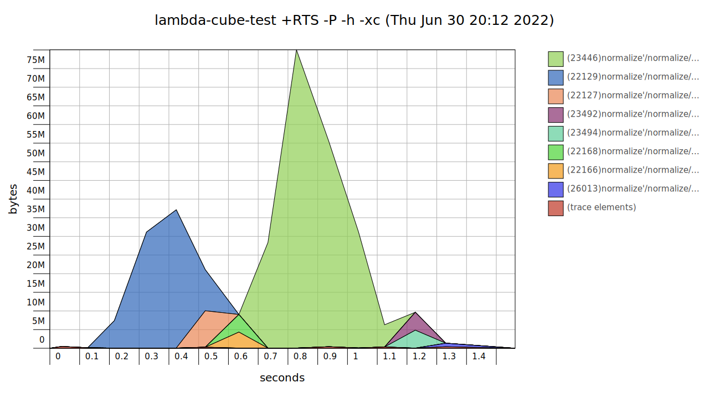

# λ-Cube
Some thoughts on Calculus of Constructions

[](https://github.com/AdamLassiter/lambda-cube/actions/workflows/haskell.yml)
[](https://adamlassiter.github.io/lambda-cube/)
[](https://codecov.io/gh/AdamLassiter/lambda-cube)
[](/LICENSE)


## Compile, Test and Install

```sh
stack build
stack test
stack run lambda-cube-exe
```


## Performance

`stack test && prof-flamegraph`


`stack test && hp-to-pretty`



## References

* Loosely based on [ChristopherKing42/CalculusOfConstructions.hs](https://gist.github.com/ChristopherKing42/d8c9fde0869ec5c8feae71714e069214)
* Tested against the [Gabriel439/Haskell-Morte-Library](https://github.com/Gabriel439/Haskell-Morte-Library) [Prelude](https://github.com/Gabriel439/Haskell-Morte-Library/tree/master/Prelude) and [Examples](https://github.com/Gabriel439/Haskell-Morte-Library/tree/master/test/src)
